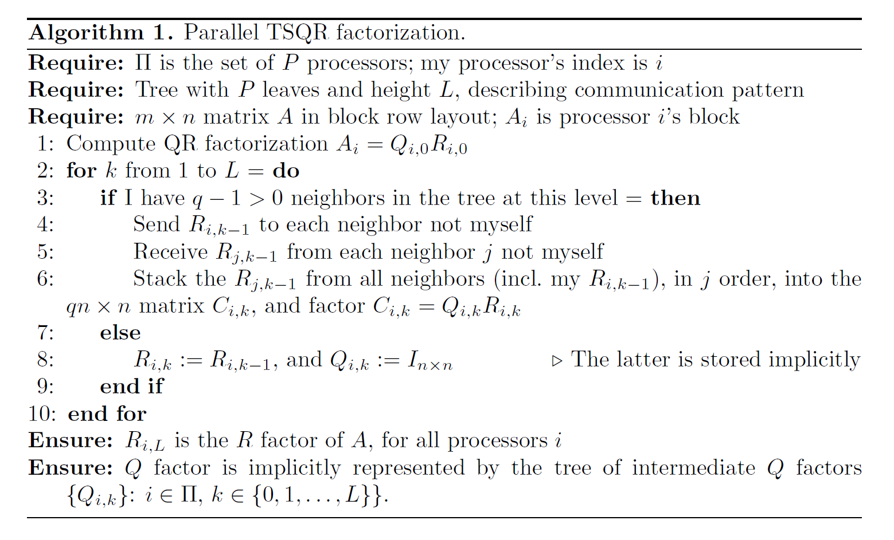

# Parallel TSQR

The tall, skinny QR (TSQR) decomposition, shown below [1], is a communication-optimal QR decomposition for matrices with many more rows than columns. 

\

### Implementations
This decomposition is implemented in several different ways. They are contained in the following folders:

  ***TSQR_one_proc_R** : This implementation computes only R. There is no redundant work done in this algorithm; the final R matrix is only contained on one processor. Any number of initial processors can be used.
  
  ***TSQR_all_proc_R** : This implementation also computes only R, but the final R matrix is computed on every processor. This is accomplished via redundant work. The tree used is a butterfly all-reduction, shown below [2]. Because of this communication pattern, the initial number of processors used to subdivide the matrix must be a power of 2. 
  
  ***TSQR_complete_QR** : This implementation is very similar to that in the TSQR_all_proc_R folder, but it also implicitly calculates Q. Q is made up of a series of orthogonal matrices locally computed and stored on each processor.

### File Inputs

There are several inputs that must be provided to run the TSQR code:
    ***m** : The number of rows in the matrix A.
    ***n** : The number of columns in the matrix A.
    ***P** : The number of "processors" that that the matrix A is divided into.
    ***m_vec (optional)**  : The row dimensions of the submatrices that the matrix A is divided into. If no dimensions are provided, then a uniform row dimension of (A/P) will be used.
    ***matrix input file** : An HDF5 file that contains the entries of the matrix A. If no input file is provided, then the matrix is initialized using a full-rank block matrix (for testing purposes).

These inputs are contained in the file config.rg and are stored in a terra struct. 

### References

[1] Demmel, James, et al. “Communication-Optimal Parallel and Sequential QR and LU Factorizations.” SIAM Journal on Scientific Computing, vol. 34, no. 1, 2 Feb. 2012, pp. A206–A239., doi:10.1137/080731992.
